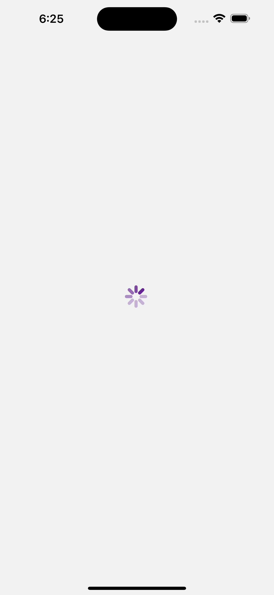
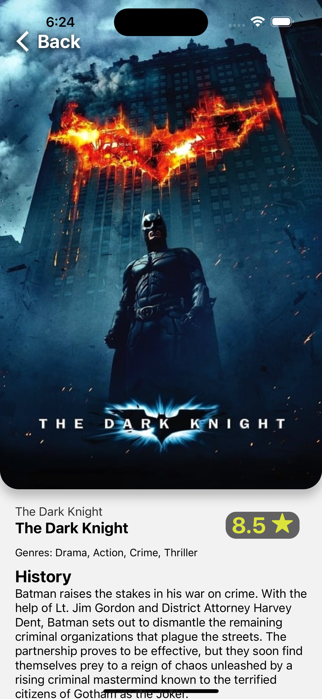
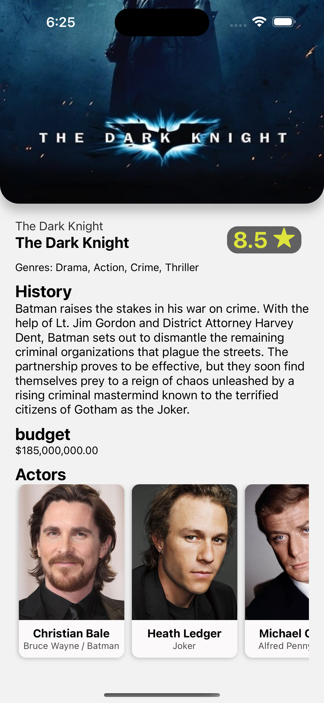

# Movies App
This is an app created in React Native and TypeScript, using navigation, images from URLs, calling APIs, and environment file.

## How to run 
- Clone/download the repo.
- Install the dependencies with `npm install`.
- Rename `.env.template` file to `.env`.
- Add your `THE_MOVIE_DB_KEY` into `.env`.
   - To get your api key go to [TMDB](https://www.themoviedb.org/).
   - Sign in.
   - Generate your api key in [TMDB settings](https://www.themoviedb.org/settings/api).
- Run the project with `npm start`.

## Screen shots 

